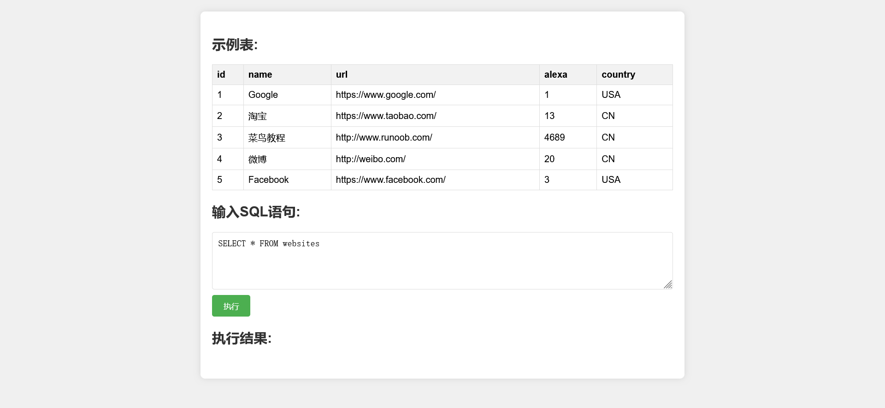
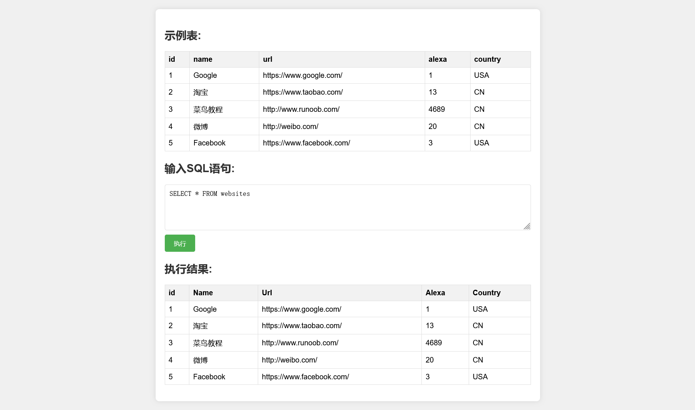

# SQL 在线测试工具

## 项目简介

SQL 在线测试工具是一个简单的 Web 应用，允许用户通过一个前端界面输入 SQL 查询并与后端 MySQL 数据库交互。前端使用 HTML 和 JavaScript 构建，后端使用 C 语言实现 HTTP 服务器，处理客户端请求并与 MySQL 数据库进行交互。

## 功能特性

- **输入 SQL 查询**：用户可以在前端输入任意 SQL 查询。
- **显示查询结果**：执行查询后，结果将在网页上以表格形式展示。
- **支持基本的 GET 和 POST 请求**：后端支持处理 HTTP 请求并返回相应的结果。

## 技术栈

- **前端**:
  - **HTML**: 用于构建网页结构。
  - **CSS**: 用于样式设计，使网页更美观。
  - **JavaScript**: 用于处理用户交互，发送 HTTP 请求到后端，并动态更新页面内容。
- **后端**:
  - **C 语言**: 主要编程语言，负责实现服务器逻辑。
  - **多线程**: 使用 pthread 库实现多线程处理，通过创建新线程处理每个客户端请求，提高服务器的并发能力。
  - **Socket 通信**: 使用 POSIX socket API 进行网络通信，处理客户端的 HTTP 请求和响应。
  - **MySQL C API**: 利用 MySQL 客户端库与数据库进行交互，执行 SQL 查询并处理结果。
  - **HTTP 协议**: 理解和实现 HTTP 协议，包括请求解析、响应构造等。

## 开发环境

- **编译器**: GCC（GNU Compiler Collection）。
- **数据库**: MySQL C 客户端库。
- **服务器**: Ubuntu。

## 目录结构

/project-root
│
├── index.html           # 前端 HTML 文件
├── server.c             # 后端 C 语言代码
├── README.md            # 项目说明文件
## 使用说明

### 前端

1. 在服务器地址栏输入服务器的ip地址+8000端口进入 `index.html` 。

2. 在输入框中输入 SQL 查询（例如：`SELECT * FROM websites`）。

	

3. 点击 "执行" 按钮，查看查询结果。

	

### 后端

1. 确保安装了 MySQL 数据库，并创建相应的数据库和表。
2. 修改 `server.c` 文件中的 MySQL 连接参数替换为你的数据库连接信息：
   ```c
   if (!mysql_real_connect(conn, "localhost", "myuser", "mypassword", "mydatabase", 0, NULL, 0))

3. 编译并运行后端服务器：
   ```bash
   gcc server.c -o sql_http_server -lmysqlclient -lpthread
   ./sql_http_server
   ```

4. 服务器默认运行在端口 8000。


## Linux下mysql的安装和使用

在Linux上安装MySQL并使其可以通过C语言调用的步骤如下：

### 1. 安装MySQL

首先，你需要在你的Linux系统上安装MySQL。可以使用以下命令：

```bash
sudo apt update
sudo apt install mysql-server
```

### 2. 安装MySQL开发库

为了通过C语言与MySQL交互，你需要安装MySQL的开发库：

```bash
sudo apt install libmysqlclient-dev
```

### 3. 配置MySQL

安装完成后，你可能需要配置MySQL。运行以下命令来启动MySQL服务：

```bash
sudo service mysql start
```

然后，安全配置MySQL：

```bash
sudo mysql_secure_installation
```

按照提示设置root密码并进行安全配置。

### 4. 创建数据库和用户（可选）

你可以使用以下命令登录MySQL并创建数据库和用户：

```bash
sudo mysql -u root -p
```

然后在MySQL命令行中运行：

```sql
CREATE DATABASE mydatabase;
CREATE USER 'myuser'@'localhost' IDENTIFIED BY 'mypassword';
GRANT ALL PRIVILEGES ON mydatabase.* TO 'myuser'@'localhost';
FLUSH PRIVILEGES;
```

### 5. 编写C代码

以下是一个简单的C程序示例，演示如何连接到MySQL数据库：

```c
#include <stdio.h>
#include <mysql/mysql.h>

int main() {
    MYSQL *conn;
    MYSQL_RES *res;
    MYSQL_ROW row;

    conn = mysql_init(NULL);
    if (conn == NULL) {
        fprintf(stderr, "mysql_init() failed\n");
        return EXIT_FAILURE;
    }

    if (mysql_real_connect(conn, "localhost", "myuser", "mypassword", "mydatabase", 0, NULL, 0) == NULL) {
        fprintf(stderr, "mysql_real_connect() failed\n");
        mysql_close(conn);
        return EXIT_FAILURE;
    }

    if (mysql_query(conn, "SELECT * FROM mytable")) {
        fprintf(stderr, "SELECT * FROM mytable failed. Error: %s\n", mysql_error(conn));
        mysql_close(conn);
        return EXIT_FAILURE;
    }

    res = mysql_store_result(conn);
    if (res == NULL) {
        fprintf(stderr, "mysql_store_result() failed. Error: %s\n", mysql_error(conn));
        mysql_close(conn);
        return EXIT_FAILURE;
    }

    while ((row = mysql_fetch_row(res)) != NULL) {
        printf("%s\n", row[0]); // 假设mytable的第一列是你想打印的内容
    }

    mysql_free_result(res);
    mysql_close(conn);
    return EXIT_SUCCESS;
}
```

### 6. 编译和链接

在编译时，需要链接MySQL库。使用以下命令编译你的C程序：

```bash
gcc your_program.c -o your_program -lmysqlclient
```

### 7. 运行程序

运行编译好的程序：

```bash
./your_program
```

确保你已经创建了相应的数据库和表，以便程序能够正确执行。

## 代码说明

好的，以下是更新后的代码说明部分：

## 代码说明

该部分提供了对后端代码的结构和顺序的说明，帮助读者更好地理解和阅读源码。

1. **`main` 函数**: 
   - 入口函数，初始化服务器，启动监听，接受客户端连接。
   - 创建线程处理每个请求。

2. **`startup` 函数**: 
   - 设置并启动服务器的 Socket。
   - 绑定到指定端口，准备接收请求。

3. **`accept_request` 函数**: 
   - 处理客户端请求，解析请求方法和 URL。
   - 根据请求方法调用相应的处理函数（`handle_get` 或 `handle_post`）。

4. **`handle_get` 函数**: 
   - 处理 GET 请求，主要负责返回静态文件（如 `index.html`）。

5. **`handle_post` 函数**: 
   - 处理 POST 请求，接收 SQL 查询并与数据库交互。
   - 执行 SQL 查询并返回结果，构建 JSON 格式的响应。

6. **`send_response` 函数**: 
   - 发送 HTTP 响应给客户端，包括状态码和内容。

7. **错误处理函数**:
   - `bad_request`, `not_found`, `unsupported_request`: 处理错误请求，返回相应的 HTTP 状态和错误信息。

8. **辅助函数**:
   - `get_line`: 读取客户端发送的请求行。
   - `index_file`: 返回指定的 HTML 文件。
   - `get_content_type`: 根据文件扩展名确定内容类型。
   - `send_file`: 发送文件内容给客户端。

请按照以上顺序阅读代码，以便理解整个服务器的工作流程。

## 注意事项

- 确保 MySQL 数据库运行正常，并已创建相应的表和数据。
- 需要安装 MySQL C 客户端库。
- 该项目是一个基础示例，不适合用于生产环境。


